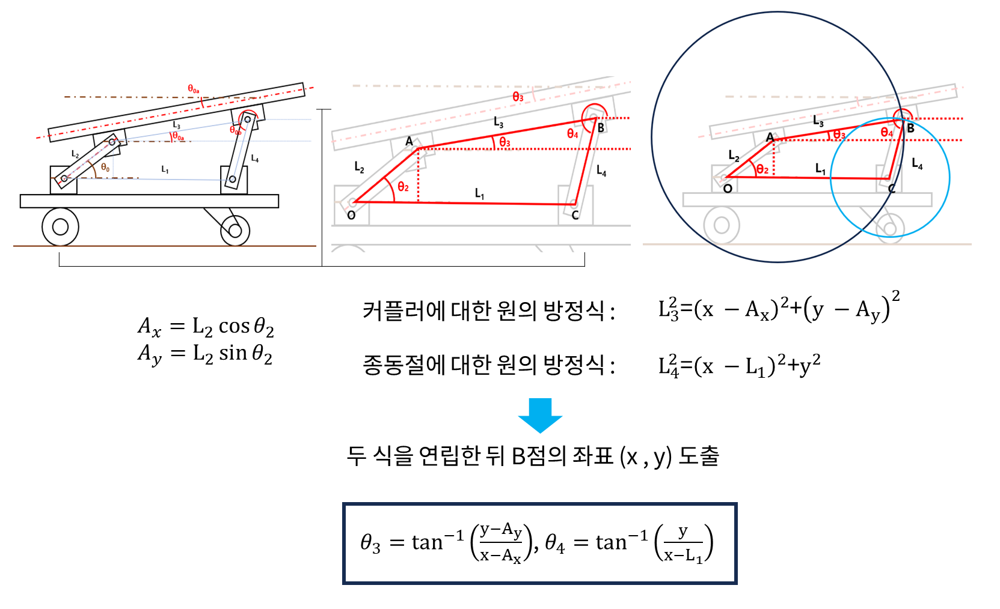

## 4절링크 해석 방법

### 설명
- (1번째 그림) 실험에서 사용될 구조는 상판에 부착될 가속도-자이로 센서에 의해 상판과 하단의 각도차를 알 수 있으며(${\theta}_{0a}$), 4절링크의 특성상 자유도가 1이므로, 하판과 상판의 각도인 ${\theta}_0$을 결정할 수 있습니다.
- (2번째 그림) 이때, 그림과 같이 설정된 원점 O에 대하여 각각의 좌표는 다음과 같습니다.  
```math
A(L_{2}cos{\theta}_{0}, L_{2}sin{\theta}_{0})
```  
```math
B(L_{2}cos{\theta}_{0} + L_{3}cos{\theta}_{0a}, L_{2}sin{\theta}_{0} + L_{3}sin{\theta}_{0a})
```
- (3번째 그림) 커플러($L_3$)와 종동절 ($L_4$)에 대하여 각각의 원을 그리면 그림과 같습니다. 앞서 구했던 것처럼 각 점에 대한 좌표를 알고 있어 원의 방정식을 통해 다음과 같은 방정식을 구할 수 있습니다.  
커플러에 대한 원의 방정식: $(x-L_{2}cos{\theta_{0}})^2 + (y-L_{2}sin_{\theta_{0}}^2=L_{3}^{2})$  
종동절에 대한 원의 방정식: $(x-L_{1})^2 + y^{2}=L_{4}^{2}$  
따라서,  
$${\theta}_0={\pi}r^2$$  
- (2번째 그림) 이에 따라, 그림에 나타난 ${\theta}_{3}$과 ${\theta}_{4}$는 아래 식을 따릅니다.
```math
{\theta}_{3}=tan^{-1}(\frac{y-A_y}{x-A_x}) \\   
{\theta}_{4}=tan^{-1}(\frac{y}{x-L_1})
```  
> ### 참고자료
> - https://happhi.tistory.com/67